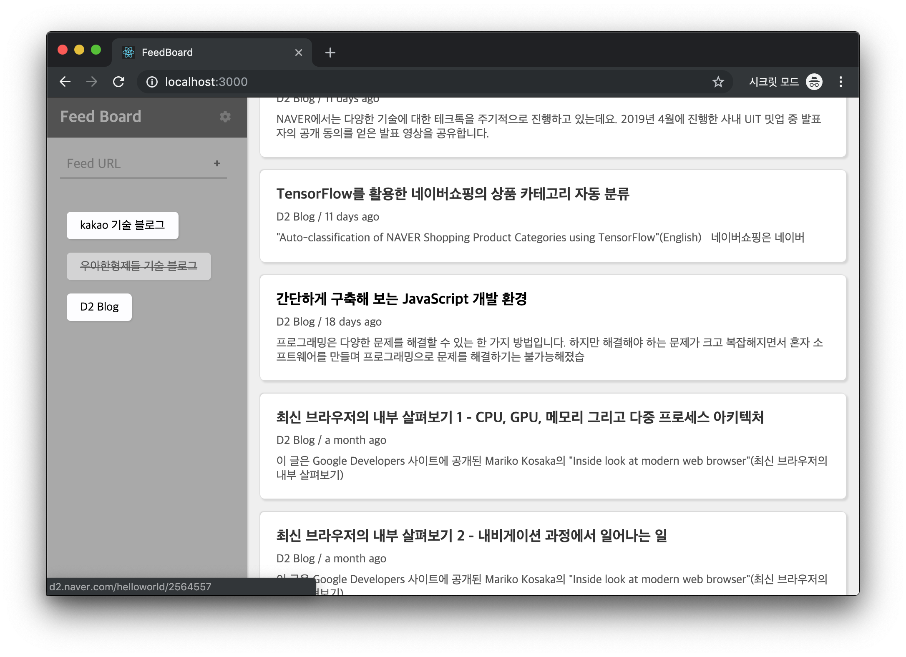

# Feed Board (rss-reader)

블로그 RSS 등 피드를 불러와 보기 편하게 보여주는 웹앱

- rss 주소(feed URL)를 통해 구독하고 싶은 사이트를 추가합니다.
  - rss 주소를 모르더라도 몇가지 대표적 RSS 주소로 추가를 시도하여 블로그 주소만으로도 추가가 가능 할 수 있습니다.
- 추가된 사이트중에서 특정 사이트의 포스트들을 리스트에서 출력을 감추고 보이게 할 수 있습니다.
- 설정에서 사이트의 이름을 바꾸거나, 사이트를 제거할 수 있습니다.

해당 웹앱의 데이터는 브라우저의 localStorage에 저장됩니다.

## Built with:

- React
  - create-react-app v2
- redux / react-redux
- SASS(SCSS)
- lodash
- moment.js
- font-awesome
- ESLint(airbnb)

---

